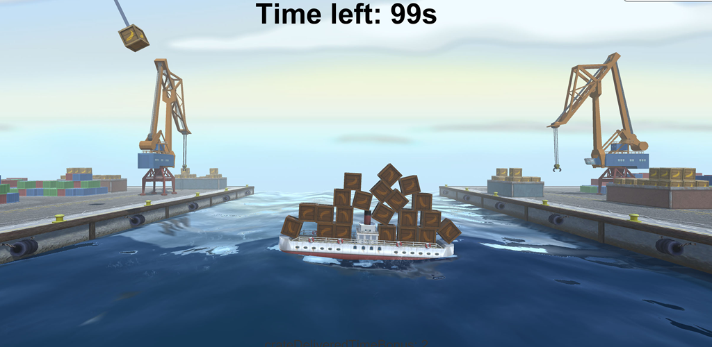
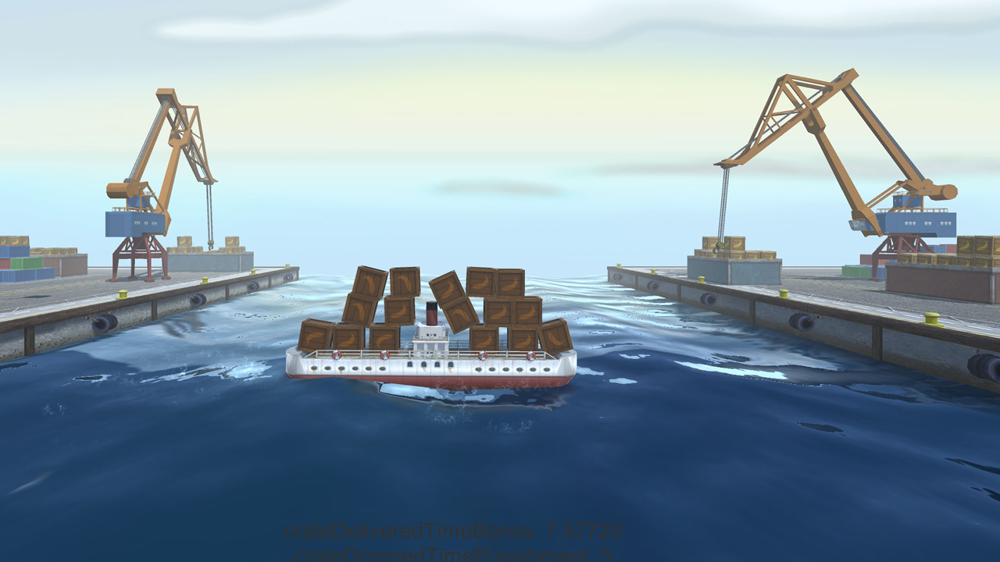

# Bananpiren (Unity3D game)
Your job is to transport banana crates from one side to the other. 

## Open beta (Android)
(https://play.google.com/apps/testing/com.crocoraff.bananpiren)

## Build it yourself
Clone and open in Unity3d. Fix references to purchased plugins (since I can't open source them) and put your own key in the keystore for Android publishing.

### Prerequisites
Visual Studio (Tested on Visual Studio CE 2017)

## Publisher
* [Crocoraff](http://crocoraff.se)

## Authors
* **Sebastian Nilsson** - [sebastiannilsson.com](http://sebastiannilsson.com)
* **Jonathan Nilsson** - [jonathannilsson.com](http://jonathannilsson.com)

## License

* All code is licensed under the MIT License - see the [LICENSE.md](LICENSE.md) file for details
* All music by Viktor Envall is licensed under Attribution-ShareAlike 4.0 International

## Acknowledgments
* **Viktor Envall** - Author of the custom music with inspiration from Harry Brandelius ("det har kommit en båt med bananer"), and Fred Åkerström ("Gamla Nordsjön").